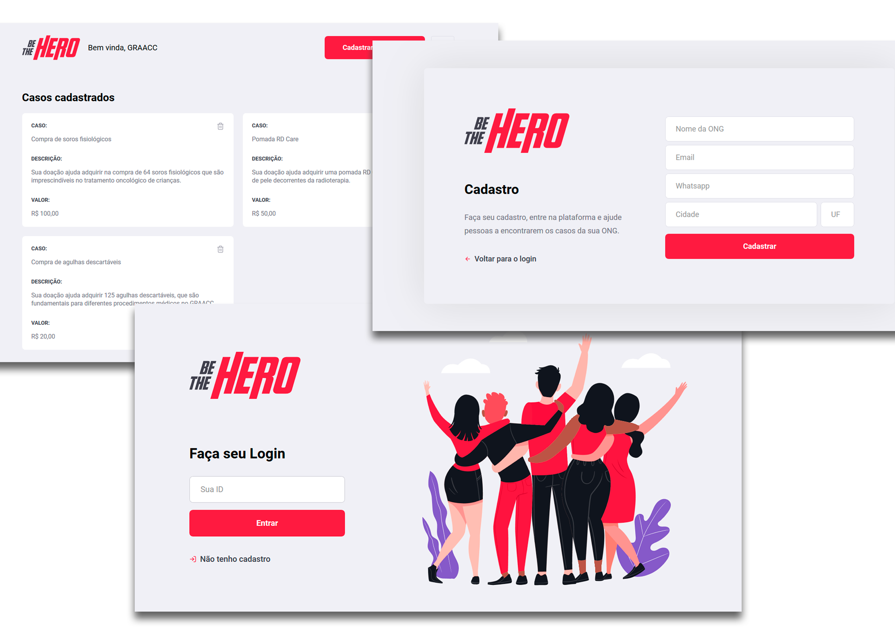
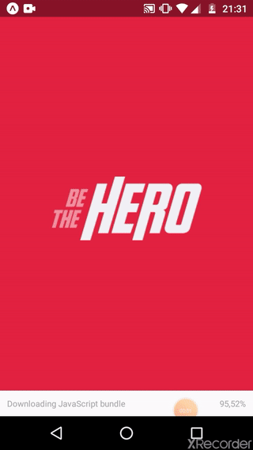

<h1 align="center">
<br>

<br>
<br>
Be The Hero 🦸‍♂️
</h1>


<h2 align="center">Site</h2>
<h3 align="center">

</h3>
<br/>
<h2 align="center">Aplicativo Mobile</h2>
<h3 align="center">

</h3>
<br/>

<h3 align="center">
Uma aplicação fullstack onde ONGs podem cadastrar casos que precisam de ajuda e recebem doações através do aplicativo no celular
</h3>

## Instalação
### Backend/API
Clone este repositório e instale as dependências
```sh
git clone https://github.com/rafaelsouz/bethehero.git
cd bethehero/backend
yarn
# ou
npm install
```

### Rodar Backend/API
```
yarn dev
```
> Lembre-se de deixar rodando o backend...

### Frontend
Instale as dependências dentro da pasta `be-the-hero/frontend`
> Em um novo terminal execute os comandos:
```sh
cd frontend
yarn
# ou
npm install
```
### Rodar Frontend
```
yarn start
```
### App Mobile
O modo mais fácil de rodar esse aplicativo no **Android** é utilizando o [Expo](https://expo.io/).
Primeiro instale o `expo-cli` de forma global em sua máquina. 
Dentro da pasta `be-the-hero/mobile` instale as dependências do app, em seguida execute o app.
```
npm install -g expo-cli
yarn
yarn start
``` 
Ao abrir uma aba em seu navegador do **Expo DevTools** com o **QRCode**, baixe o aplicativo do **Expo** em sua [play store](https://play.google.com/store/apps/details?id=host.exp.exponent) e faça o Scan do QRCode em seu celular.

- No arquivo `service/api` incluir em `LOCALHOST` o URL que aparece pra você no **Expo DevTools** (Em cima do QRCode).

Utilizei as seguintes tecnologias:

-  [Node.js](https://nodejs.org/en/)
-  [Express](https://expressjs.com/)
-  [nodemon](https://nodemon.io/)
-  [Knex](http://knexjs.org/)
-  [celebrate](https://www.npmjs.com/package/celebrate)
-  [Sqlite3](https://www.npmjs.com/package/sqlite3)
-  [Cors](https://www.npmjs.com/package/cors)
-  [cross-env](https://www.npmjs.com/package/cross-env)
-  [sucrase](https://www.npmjs.com/package/sucrase)
-  [supertest](https://www.npmjs.com/package/supertest)
-  [jest](https://www.npmjs.com/package/jest)
-  [VS Code](https://code.visualstudio.com/) with [ESLint](https://eslint.org/)

---

Made with ♥ by Rafael Souza :wave: [linkedin](https://www.linkedin.com/in/rafaelsouz/)
